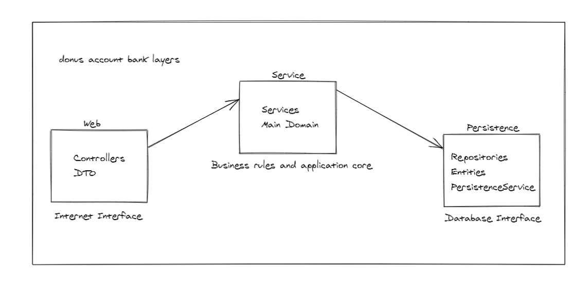

# donus-account-bank

## Project Description
Challenge [Spring Boot](http://projects.spring.io/spring-boot/) to Donus.

The construction of the project had as main objective to make the most of all the concepts preached by SOLID and part of the development the TDD concepts were used for this.

Thinking about an evolution towards a clean architecture, the responsibilities were divided so that in the future each layer becomes a module, to facilitate implementation DDD concept was used a lot and each chain has its domain while the main domain of the application is shared.

## Layers representation


## Requirements

For building and running the application you need:

- [JDK 1.8](http://www.oracle.com/technetwork/java/javase/downloads/jdk8-downloads-2133151.html)
- [Maven 3](https://maven.apache.org)

## Running the application locally

There are several ways to run a Spring Boot application on your local machine. One way is to execute the `main` method in the `br/com/donus/donusaccountbank/DonusAccountBankApplication.java` class from your IDE.

Alternatively you can use the [Spring Boot Maven plugin](https://docs.spring.io/spring-boot/docs/current/reference/html/build-tool-plugins-maven-plugin.html) like so:

```shell
mvn spring-boot:run
```
To run all Tests you can use Maven, like this:
```shell
mvn tests
```
